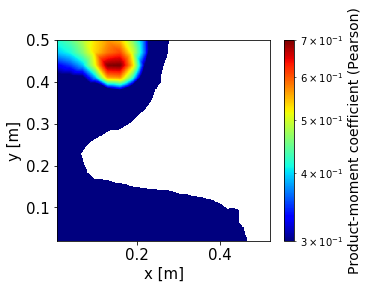
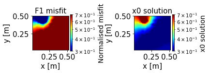
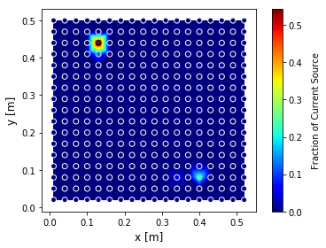

The Mise-à-la-masse method
==========================

Background
----------

The Mise-à-la-masse (MALM) method is a variation of the classical
electrical tomography map, for which the current is injected into the
ground by two electrodes of contrary sign and the potential is measured
between two mobile points.

MALM implementation is based on three assumptions:

#. the electrical conductivity of the root system body should be enough
   high to flow the current;

#. the conductor core should be continuous

#. and already located or exposed

The MALM forward operator
-------------------------

For a 3-D, isotropic electrical-conductivity distribution,
:math:`\sigma(r)`, the electric potential, :math:`V(r)`, at a point r
due to a single current electrode, idealized as a point source at the
origin with strength I, is defined by the Poisson equation:

.. math::

   \label{eq:PoissonEq}
       \Delta \cdot (\sigma \Delta V) = -I \varsigma(r)

subject to the condition:

.. math::

   \label{eq:PoissonEqCond}
   \frac{\partial V}{\partial n} = 0

at the ground surface and the condition

.. math::

   \label{eq:PoissonEqCond2}
   V = 0

at other, infinite boundaries; with :math:`\varsigma` the Dirac delta
function and n the outward normal.

where :math:`\sigma` is the conductivity of the medium, here assumed to
be defined by the conductivity distribution. The latest is in general
obtained from an Electrical Resistivity Tomography (ERT) data inversion.

Green functions simulation
--------------------------

The first step consist in using Eq.\ `[eq:PoissonEq] <#eq:PoissonEq>`__
in order to forward simulate the voltage distribution generated by
individual point current sources placed in the medium, each representing
the possible location of current released.

In order to distinguish between the active sources used during the
prospection and the current sources used to generate the green functions
the latest are usually called virtual sources (VRTs).

The current Sources can be distributed on a regular grid of virtual
electrodes (VRTe) or an unstructured one. We hypothesized that the
number of locations for current sources, should be distributed in space
considering the prospection geometry i.e. the spatial distribution
(control by the distance between the electrode) and coverage.

The MALM forward simulation takes into account the electrical
conductivity :math:`\sigma` distribution generally known after ERT
inversion.

Problem linearisation
---------------------

The iCSD inversion that we propose here takes advantage of the physics
of the problem (i.e.,linearity and charge conservation) to decompose the
investigated CSD into the sum of point current sources. For linearity,
the potential field of multiple current sources is the sum of their
potential fields: the measured :math:`\Delta`\ V can be viewed as, and
decomposed into, the sum of multiple :math:`\Delta` V due to a set of
possible current sources :raw-latex:`\cite{LucaPlantAndSoil}`. Let’s
then assume, a linear system of equations linking data and model for
potential fields:

.. math:: Ax=b

Where :math:`\textbf{b}` is a vector containing the measured sequence of
resistance. :math:`\textbf{A}` is the source kernel matrix, its columns
are the simulated VRTe R sequences;and x is the source model, a vector
containing the unknown VRTe weights; Each row in A corresponds to the
relative R in the acquisition sequence, e.g., :math:`\textbf{A}_{1,1}`
is the first resistance extracted from the potential field simulated
with injection at the first VRTe.

Including Constraints
~~~~~~~~~~~~~~~~~~~~~

The charge conservation is implemented by appending a row of 1’s to
:math:`\textbf{A}` and a corresponding 1 to the vector
:math:`\textbf{b}`. This forces the sum of the VRTe weights to be equal
to 1.

More in including constrainst in Menke W (1989) geophysical data
analysis: discrete inverse theory. International Geophysics Series.
Academic Press, New York.

Problem regularisation
----------------------

Data regularisation
~~~~~~~~~~~~~~~~~~~

In the algoritm current state the observations data can be weigted in
three different ways for which the weighted :math:`W_{d}` is equal to:

#. a constant vector;

#. the inverse of the square of the observed resistances
   :math:`1/\sqrt{d}`;

#. the inverse of the error from the reciprocal measurements
   :math:`1/\sqrt{Err_{rec}}` (NOT YET IMPLEMENTED);

Model regularisation
~~~~~~~~~~~~~~~~~~~~

.. _para_prior:

Prior informations
^^^^^^^^^^^^^^^^^^

The initial model :math:`\textbf{m}_{0}` vector is implemented using the
simple misfit between a single source current and the measured data:

.. math::

   \label{eq:PriorObjFct}
       F_{1,i}\left(d_{m},\ d_{f,i}\right)=\left\|d_{m}-d_{f,i}\right\|^{2}

The goal of this step is to select “plausible” locations of current
release, to be then used as starting points for a regularized search of
the overall sources distribution (see step below). Each single current
location is given a score (named F1) depending on how well that single
source manages, alone, to explain the entire observed MALM voltage
distribution. Other approaches can be considered as a 1st attempt to
describe regions of influences without having to go trough a complete
inversion (see sect. ).

Depth weighting function
^^^^^^^^^^^^^^^^^^^^^^^^

As for imaging methods, inversion methods also assume, inherently or
explicitly, a depth weighting function.

Additional weightings can also be incorporated through, such as depth
weighting, which is important in potential field inversions (such as
magnetics and gravity), or sensitivity weightings to prevent model
structure from concentrating close to sources or receivers (Li and
Oldenburg, 1996a, Li and Oldenburg, 2000c).

A depth weighting matrix is generally applied to the kernel during
inversion to counteract the sensitivity of the kernel matrix to near
surface model parameters.

Compactness
^^^^^^^^^^^

Compactness or minimum support (MS) method (Zhdanov and Tolstaya, 2004)
is a constraints to reach a compact source current density.

Spatial regularization
^^^^^^^^^^^^^^^^^^^^^^

-  For the 2d case, since the problem is undetermined a first order
   spatial regularization is added (Menke, 1989). Rows are added to
   express the differences between adjacent VRTe, e.g., the row
   :math:`\left[\begin{matrix}1&-1&\ldots\\\end{matrix}\right]`\ is the
   difference between the first two VRTe weights. The differences are
   added for the entire VRTe grid and set to 0 by adding corresponding
   0’s to b.

-  A second order spatial regularization with differentiation
   between x and y directions to obtain two different matrices (of the
   same size) such as :math:`D_{x}` and :math:`D_{y}`

-  For the 3d case, a k-mean with 4 (or more) neighbors sources
   regularization can be used. In that case each source is weighted so
   the sum is equal to 0.

We used a linear solver from Python library, using a least square
inversion which in the current version minimized the following objective
function:

.. math::

   \label{eq:ObjFctFull}
       \widetilde{m}=\ min \left\{\left\|Lr\right\|^{2} + \lambda(\alpha_{s}\left\|m-m0\right\|^{2}+ \alpha_{x}\left\|D_{x}(m-m0)\right\|^{2} + \alpha_{z}\left\|D_{z}(m-m0)\right\|^{2})\right\}

where :math:`\textbf{m}_{0}` is a reference model to which we believe
the physical property distribution should be close. Often
:math:`\textbf{m}_{0}` is chosen to be a constant average value. In that
case the initial model :math:`\textbf{m}_{0}` vector is implemented
using the simple misfit between a single source current and the measured
data:

Equation `[eq:ObjFctFull] <#eq:ObjFctFull>`__ also contains the
coefficients controlling weight of the relative smallness
:math:`\alpha_{s}`, and the regularization anisotropy wieigth
:math:`\alpha_{x}` and :math:`\alpha_{y}`\ respectively in x and y
directions.

::

   from icsd3d_class import iCSD3d_Class as i3d

   [...]

   # use relative smallness model reg
   id3d.x0_prior=True 
   id3d.alphax0=1 # weight of relative smallness
   # use anisotropic smoothing regularisation fct
   id3d.alphaSxy=True 
   id3d.alphaSx=1 # x-smooth
   id3d.alphaSy=1 # y-smooth
       

Equation `[eq:ObjFctFull] <#eq:ObjFctFull>`__ can be rewritten as:

.. math::

   \label{ObjFct2}
   \widetilde{m}=\ min\left\{{(Gm-d)}^TW_d(Gm-d)\ +\ \lambda{(m-m_0)}^{T}W_m(m-m_0)\right\}

Where

.. math::

   \label{eq:Wd}
   W_{d}=L^{T}L

-  Luca’s version: :math:`W_m`\ =1st order spatial regularisation
   (-1,1))

-  New version:
   :math:`W_{m}=\alpha_{s}I+{D_{x}}^{T} D_{x} +D_{z}^{T}D_{z}`

(See regularisation class fiatando code for in depth understanding)

The trade-off between data misfit and solution regularization is
controlled by :math:`\lambda`. The numerical routine includes a “pareto”
functionality wherein regularization and model-to-measurement fit are
traded off while changing the regularization weight. The obtained set of
solutions can be used to construct the “pareto front” (L-curve), which
is a widely accepted way to estimate the optimum regularization weight
:raw-latex:`\cite{hansen1993insect}`.

The solution is further constrained by forcing the linear solver to seek
only positive VRTe weights (i.e., inequality constraint), as the
negative source of current is known to correspond uniquely to the return
electrode. The following equation can be use to solve the inversion
problem:

.. math::

   \label{eq:m}
   m={(G^{T}W_{d}G\ +\ \lambda W_{m})}^{-1}(G^{T}W_{d}d\ +\ \lambda W_{m}m_{0})

by solving the system Am=b, with:

.. math::

   \label{eq:Aside}
   A=(G^{T}W_{d}G\ +\ \lambda W_{m})

.. math::

   \label{eq:Bside}
   b=(G^{T}W_{d}d\ +\ \lambda W_{m}m_{0})

Other approaches
----------------

The product-moment correlation
~~~~~~~~~~~~~~~~~~~~~~~~~~~~~~

Rather than approach the measure of misfit between the model and the
data in terms of a least squares fit, the correlation of data to model
may be used. The product-moment correlation is expressed here as:

.. math::

   \label{eq:productmoment_corr}
   r_{k}= \frac{\sum_{i}(D_{I}-\overline{D})(F_{i}(I_{k})-\overline{F}(I_{k}))}{\sqrt{\sum_{i}(D_{I}-\overline{D})^{2}}\sum_{i}(F_{i}(I_{k})-\overline{F}(I_{k}))^{2}}

where :math:`D_{i}` is the :math:`i^{th}` measured transfer resistance
and :math:`F_{i}(I_{k})` is the :math:`i^{th}` transfer resistance
computed to unit current at location k.

:raw-latex:`\cite{binley1997detecting}`

API exemple of the use of product-moment correlation apply to a
synthetic test.

::

   from icsd3d_class import iCSD3d_Class as i3d
   import pyvista as pv

   icsd3d_SensApriori=i3d(dirName=path2files)   
   icsd3d_SensApriori.type='3d'
   icsd3d_SensApriori.sim='SIM_sens3d.txt'
   icsd3d_SensApriori.obs='OBS_sens3d.txt'
   icsd3d_SensApriori.showResultsFini(method='Pearson')

