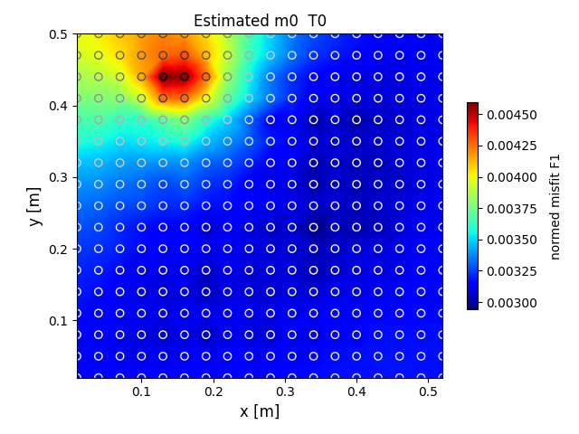
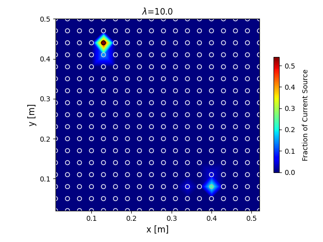
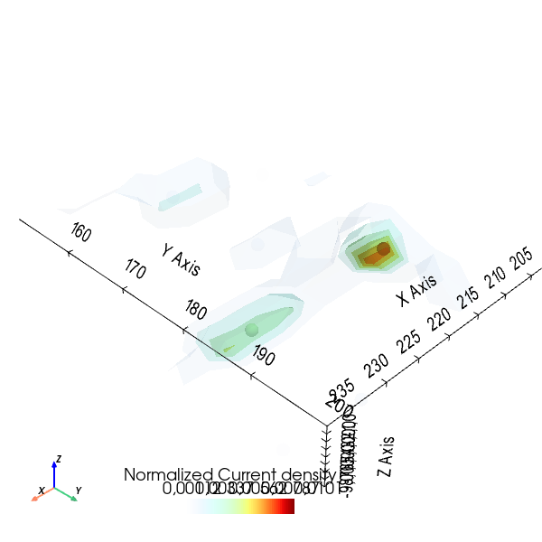

# Summary

<!-- Begin your paper with a summary of the high-level functionality of your software for a non-specialist reader. Avoid jargon in this section.
The paper should be between 250-1000 words
A Statement of need section that clearly illustrates the research purpose of the software and places it in the context of related work.

For a quick reference, the following citation commands can be used:
- `@author:2001`    "Author et al. (2001)"
- `[@author:2001]`  "(Author et al., 2001)"
- `[@author1:2001; @author2:2001]`  "(Author1 et al., 2001; Author2 et al., 2002)"

-->

Most of the codes available for the interpretation of geoelectrical survey focus on revovering the subsurface electrical resistivity. 
For some specific cases, when a direct excitation of the a conductive body (or mass) is applied, it is more relevant to map the electrical current density within the subsurface. 
The `icsd` open-source generic algorithm provide a scheme for the inversion of subsurface current source density. 
It targets the geophysical community in primary and provide readers and parsers for two of the most widely used libraries for forward/inversion geoelectrical libraries i.e. pyGIMLI and Resipy. 
The `icsd` package keep the dependencies to the bare minimum to encourage other libraries to depend on. 
The technique adopted is a logical extension of the work of [@binley_detecting_1997; @binley_detecting_1999]. 
The mathematical formulation is also borrowed from the neurosciences community who develop the same approach for the medical imaging.

# Statement of need

**Background**

The original geophysical prospection method consisting in injecting the current directly into a mass is call from the French "Mise-à-la-masse". 
The fundamentals of the Mise-à-la-masse are describe in [@parasnis_threedimensional_1967, @schlumberger_etude_1920. @stierman_electrical_1984]. 
In this manuscript we rather call it, Electrical Current Imaging (ECI), since it is a broader terminology adopted by many authors in the past.
Current density increases within conductive regions, and decreases within resistive regions.
Charges build up at interfaces between regions of different electrical conductivity. 
Variations in charge distribution are detected as variations in distribution of potential, or voltage, at the surface. 
Originally this method was developed for mining prospection but is now used for a variety of target including: deposit [@bhattacharya_misemasse_2001], environemental leakage monitoring [@binley_detecting_1997; @binley_detecting_1999, @Colucci], tracer injection/ contamination plume delineation [@perri_time-lapse_2018], civil engenering [@heagy_direct_2019], karst and fractured subsurface monitoring [@guerin_geophysical_2009; @beasley_threedimensional_1986,@chalikakis_contribution_2011] and more recently Roots imaging MALM [@mary_time-lapse_2020; @mary_assessing_2019,@mary_small-scale_2018, @peruzzo_imaging_2020] and geothermal energy. 
Other non geohysical application exists. For instance, the current source density inversion is applied in the neurosciences for medical imaging.  

**Existing approaches for ECI interpretation and inversion**

Although the large adoption of the method, very few codes are available. 
The `icsd` algorithm is part of the familly of mathematical minimisation problem and follow the same mechanism than other methods i.e. linerisation of the problem, least square optimisation. 
For the mathematical formulation of the problem the reader must refer to @peruzzo_imaging_2020. 
Compare to classical inversion of ERT [@rubin_dc_2005], the current source inversion looks to minimize the measured voltage with Green functions (solution of for a user-defined grid of current sources distributed in the subsurface) with the inverted ERT values as a background initial resistivity. Also one additionnal constraints must be accounted for the conservation of the current (sum equal to 1). 
Authors used custum procedure to interpret ECI data, varying from simple qualitative analysis to classical. 
[@binley_detecting_1997; @binley_detecting_1999, colucci_locating_1999] approach is akin to the genetic inversion algoritm. 
<!-- An initial distribution of current source is created on a regular grid and is then sequentially perturbated, evaluated and improved by minimizing a the standart deviation data misfit. 
-->

@shao_finding_2018, 
[@wondimu_3d_2018,@hatanaka_three-dimensional_2005]
@ling_leakage_2019
@ronczka_numerical_2015
[@heagy_direct_2019] explores using simulations the relation between the conductivity, the distribution of current density, the charge density and the electric field distribution for direct current resistivity with steel-cased wells. The current density is infer analytically (?). 
<!--
Figure 4.14 (see also https://em.geosci.xyz/index.html). 
-->
The inversion of streaming potentials (SP) another well know goephysical methods also generally search to infer the distribution of current density naturally generated. 
@soueid_ahmed_sp2dinv_2013 propose an algortim to achieve the multisteps required. 
<!--
In this methods, the data are assumed to be represented by a linear combination of the Green’s functions. 
-->
@boissevain_mise---masse_1982 introduce some fundamentals of MALM IP but despite the progress on IP techniques there has been a dearth of reports concerning it.
@shao_finding_2018 developed a similar approach has been develop for the inversion of current in Time Domain Induced Polarization (TDIP, without injection into the body). 
    

<!--

    • Topography correction: (Oppliger, n.d.)
    • Correction en 1/r ?
    • Model appraisal: (Binley and Kemna, 2005), gars cours venice , (Ren and Kalscheuer, 2020)
-->

**Potential**

The potential of such a procedure is big knowing that current methods to interpret ECI data are limited to a qualitive observation of the shape of the voltage data. 
ECI is a ill problem meaning that several models can produce the resulting shapes. 
For a quantitative interpretation inversion is required. 
The current implementation allows for: 

- A 2d and 3d inversion of current sources with respective spatial regularizations schemes
- L-curve analysis to choose the best tradeoff between data and model regularization
- Unconstrainsted inversion VS Constrainsted inversion with a variety of strategy for the initial model. 

<!--
Quality of the result is evaluate using RMS. 
Morevover, the potential of the `icsd` algortim can be extended to all the inclusion of a-priori information in the form of model depth-weighting [@cella_inversion_2012], (Oldenburg and Li, n.d.), refined optimisation spatial procedure taking into account the anisotropy (de Villiers et al., 2019), or even time lapse inversion. 
-->

# Example Usage 

To start with the analysis we recommand a simple preliminary visualisation of the ECI data. 

Furthermore, depending the nature of the problem, the user could rapidly approximate using Binely's approach.   

For a full use of the package it has to be coupled with a forward geoelectrical model ERT [@blanchy_resipy_2020, @cockett_simpeg_2015, @rucker_pygimli_2017]. Typical procedure steps are:
1. Import and filter survey data (ERT and ECI)
2. Invert the ERT data
3. Calculate Green functions (solution of for a user-defined grid of current sources distributed in the subsurface) with the inverted ERT values as a background initial resistivity.

After the three previous steps, the icsd code can be used to invert for current source density (see the following examples)

In the current literature, the `icsd` code has been used mainly for plant roots prospection [@mary_time-lapse_2020; @peruzzo_imaging_2020]. 
We nevertheless provide a variety of synthetic example in the documentation targeting varying disciplines of the geophysics.
- Case of a synthetic landfill leakage

<!--

Citations to entries in paper.bib should be in
[rMarkdown](http://rmarkdown.rstudio.com/authoring_bibliographies_and_citations.html)
format.

Figures can be included like this:

and referenced from text using \autoref{fig:example}.

Figure sizes can be customized by adding an optional second parameter:
{ width=20% }
-->

        
# Related Software Packages

The neurosciences community developed similar algortim applied for medical imaging. 
There is a MATLAB scripts for the 2D current-source density analysis together with a GUI toolbox can be downloaded here based on the article [@leski_inverse_2011]. That iCSD has been generalized, the new kernel Current Source Density [@potworowski_kernel_2012] takes care of noise and allows reconstruction from arbitrary distribution of electrodes with a Python code available.

# Acknowledgements

Benjamin Mary acknowledges the financial support from European Union’s Horizon 2020 research and innovation programme under a Marie Sklodowska-Curie grant agreement (Grant no. 842922).

# References 
