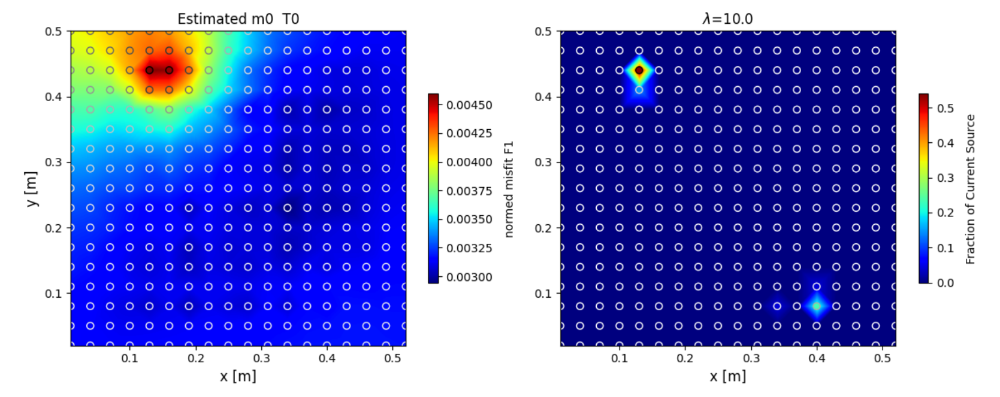

# Summary

Most of the codes available for the interpretation of geoelectrical surveys focus on recovering the subsurface electrical resistivity. For some specific cases, when a direct excitation of a conductive body (or mass) is applied, it is more relevant to map the electrical current density within the subsurface. The \`pyGeoCSD\` open-source generic algorithm provides a scheme for the inversion of subsurface current source density. It targets the geophysical community in primary and provides readers and parsers for two of the most widely used libraries for forward/inversion geoelectrical libraries i.e. pyGIMLI [@rucker_pygimli_2017] and Resipy [@blanchy_resipy_2020]. The \`pyGeoCSD\` package keeps the dependencies to the bare minimum to encourage other libraries to depend on it. The technique adopted is an extension of the work of [@binley_detecting_1997; @binley_detecting_1999]. The mathematical formulation is borrowed from the neurosciences community which developed the same approach for medical imaging.

# Statement of need

**Background \`**

The original geophysical prospection method consisting in injecting the current directly into a mass is called from the French "Mise-à-la-masse". The fundamentals of the Mise-à-la-masse are described in [@parasnis_threedimensional_1967, @schlumberger_etude_1920. @stierman_electrical_1984]. In this manuscript, we rather call it, Electrical Current Imaging (ECI), since it is a broader terminology adopted by many authors in the past. Current density increases within conductive regions, and decreases within resistive regions. Charges build up at interfaces between regions of different electrical conductivity. Variations in charge distribution are detected as variations in the distribution of potential, or voltage, at the surface. 

Originally this method was developed for mining prospection but is now used for a variety of targets including deposit [@bhattacharya_misemasse_2001], environmental leakage monitoring [@binley_detecting_1997; @binley_detecting_1999, @Colucci], tracer injection/ contamination plume delineation [@perri_time-lapse_2018], civil engineering [@heagy_direct_2019], karst and fractured subsurface monitoring [@guerin_geophysical_2009; @beasley_threedimensional_1986,@chalikakis_contribution_2011] and more recently Roots imaging MALM [@mary_time-lapse_2020; @mary_assessing_2019,@mary_small-scale_2018, @peruzzo_imaging_2020] and geothermal energy.  Others non-geophysical application exists. For instance, the current source density inversion is applied in the neurosciences for medical imaging.  

**Existing approaches for ECI interpretation and inversion**

Despite the large adoption of the method, very few codes are available. The \`pyGeoCSD\` algorithm is part of the family of mathematical minimisation problems and follows the same mechanism as other methods i.e. linearization of the problem, and least square optimisation. For the mathematical formulation of the problem, the reader must refer to @peruzzo_imaging_2020. Compare to the classical inversion of ERT [@Binley_2005], the current source inversion looks to minimize the measured voltage with Green functions (solution of for a user-defined grid of current sources distributed in the subsurface) with the inverted ERT values as a background initial resistivity. Also, one additional constraint must be accounted for the conservation of the current (a sum equal to 1). 

Authors used custom procedures to interpret ECI data, varying from simple qualitative analysis to classical. [@binley_detecting_1997; @binley_detecting_1999, colucci_locating_1999] approach is akin to the genetic inversion algorithm. 

@shao_finding_2018, 

[@wondimu_3d_2018,@hatanaka_three-dimensional_2005]

@ling_leakage_2019

@ronczka_numerical_2015

[@heagy_direct_2019] explores using simulations the relation between the conductivity, the distribution of current density, the charge density and the electric field distribution for direct current resistivity with steel-cased wells. The current density is inferred analytically (?). 

The inversion of streaming potentials (SP) another well know geophysical method also generally searches to infer the distribution of current density naturally generated. 

@soueid_ahmed_sp2dinv_2013 propose an algorithm to achieve the multi-steps required. 

@boissevain_mise---masse_1982 introduce some fundamentals of MALM IP but despite the progress in IP techniques, there has been a dearth of reports concerning it.

@shao_finding_2018 developed a similar approach has been developed for the inversion of current in Time Domain Induced Polarization (TDIP, without injection into the body). 

**Potential**

The potential of such a procedure is important knowing that current methods to interpret ECI data are limited to qualitative observation of the shape of the voltage data. ECI is an ill problem meaning that several models can produce the resulting shapes. For a quantitative interpretation, inversion is required. The current implementation allows for: 

- A 2d and 3d inversion of current sources with respective spatial regularizations schemes
- L-curve analysis to choose the best tradeoff between data and model regularization
- Unconstrained inversion VS Constrained inversion with a variety of strategies for the initial model. 

# Example Usage 

To start with the analysis we recommend a simple preliminary visualisation of the ECI data. Furthermore, depending on the nature of the problem, the user could rapidly approximate using Binley's approach. 

For full use of the package, it has to be coupled with a forward geoelectrical model ERT [@blanchy_resipy_2020, @cockett_simpeg_2015, @rucker_pygimli_2017]. 

Typical procedure steps are:

1. Import and filter survey data (ERT and ECI)
2. Invert the ERT data
3. Calculate Green functions using the inverted ERT values as a background initial resistivity. The Green functions are the solution of punctual current sources distributed in the subsurface by a user-defined grid.

After the three previous steps, the \`pyGeoCSD\` code can be used to invert for current source density (see the following examples). In the current literature, the \`pyGeoCSD\` code has been used mainly for plant roots prospection [@mary_time-lapse_2020; @peruzzo_imaging_2020]. We nevertheless provide a variety of synthetic examples in the documentation targeting varying disciplines of geophysics.       

# Related Software Packages

The neurosciences community developed a similar algorithm applied to medical imaging. 

There is a MATLAB script for the 2D current-source density analysis together with a GUI toolbox that can be downloaded here based on the article [@leski_inverse_2011]. The iCSD has been generalized, and the new kernel Current Source Density [@potworowski_kernel_2012] takes care of noise and allows reconstruction from arbitrary distribution of electrodes with a Python code available.

# Acknowledgements

Benjamin Mary acknowledges the financial support from European Union’s Horizon 2020 research and innovation programme under a Marie Sklodowska-Curie grant agreement (Grant no. 842922).

# References 
